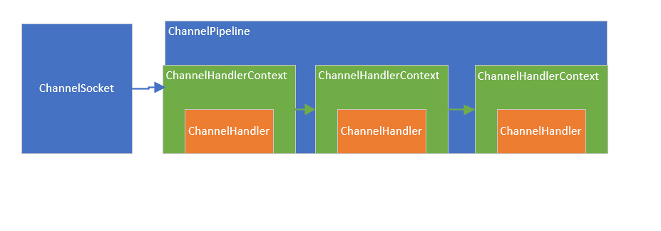

# Pipeline解析

Pipeline内部关系如图



每个Channel创建时候会创建对应的Pipeline，不同的Pipeline就会有不同的数据处理逻辑

1. 创建Pipeline的同时会创建``TailContext``和``HeadContext``组成双向链表

```java
// AbstractChannel
protected AbstractChannel(Channel parent) {
  this.parent = parent;
  id = newId();
  unsafe = newUnsafe();
  pipeline = newChannelPipeline();
}

// AbstractChannel
protected DefaultChannelPipeline newChannelPipeline() {
  return new DefaultChannelPipeline(this);
}

// DefaultChannelPipeline
protected DefaultChannelPipeline(Channel channel) {
  this.channel = ObjectUtil.checkNotNull(channel, "channel");
  succeededFuture = new SucceededChannelFuture(channel, null);
  voidPromise =  new VoidChannelPromise(channel, true);

  tail = new TailContext(this);
  head = new HeadContext(this);

  head.next = tail;
  tail.prev = head;
}
```

2. 在 add\** 添加处理器的时候创建 Context

```java
@Override
public final ChannelPipeline addLast(EventExecutorGroup group, String name, ChannelHandler handler) {
  final AbstractChannelHandlerContext newCtx;
  synchronized (this) {
    checkMultiplicity(handler);

    newCtx = newContext(group, filterName(name, handler), handler);

    addLast0(newCtx);

    // If the registered is false it means that the channel was not registered on an eventloop yet.
    // In this case we add the context to the pipeline and add a task that will call
    // ChannelHandler.handlerAdded(...) once the channel is registered.
    if (!registered) {
      newCtx.setAddPending();
      callHandlerCallbackLater(newCtx, true);
      return this;
    }

    EventExecutor executor = newCtx.executor();
    if (!executor.inEventLoop()) {
      newCtx.setAddPending();
      executor.execute(new Runnable() {
        @Override
        public void run() {
          callHandlerAdded0(newCtx);
        }
      });
      return this;
    }
  }
  callHandlerAdded0(newCtx);
  return this;
}

private void addLast0(AbstractChannelHandlerContext newCtx) {
  AbstractChannelHandlerContext prev = tail.prev;
  newCtx.prev = prev;
  newCtx.next = tail;
  prev.next = newCtx;
  tail.prev = newCtx;
}	
```

3. 当请求进来的时候，会第一个调用 pipeline 的 相关方法，如果是入站事件，这些方法由 fire 开头，表示开始管道的流动。让后面的 handler 继续处理。

```java
//DefaultChannelPipeline
@Override
public final ChannelPipeline fireChannelRead(Object msg) {
  AbstractChannelHandlerContext.invokeChannelRead(head, msg);
  return this;
}

//AbstractChannelHandlerContext
static void invokeChannelRead(final AbstractChannelHandlerContext next, Object msg) {
  final Object m = next.pipeline.touch(ObjectUtil.checkNotNull(msg, "msg"), next);
  EventExecutor executor = next.executor();
  if (executor.inEventLoop()) {
    next.invokeChannelRead(m);
  } else {
    executor.execute(new Runnable() {
      @Override
      public void run() {
        next.invokeChannelRead(m);
      }
    });
  }
}


private void invokeChannelRead(Object msg) {
  if (invokeHandler()) {
    try {
      ((ChannelInboundHandler) handler()).channelRead(this, msg);
    } catch (Throwable t) {
      notifyHandlerException(t);
    }
  } else {
    fireChannelRead(msg);
  }
}
```


## 总结

整个创建了处理请求的过程：

1. Bootstrap 创建出来之后会创建出NioEventLoopGroup，对应多个NioEventLoop
2. NioEventLoop由一个单线程组成，一直在循环的做``selector.select()``动作和``runAllTask()``
3. 当``processSelectedKeys()``获取到对应的数据准备就绪,调用到``AbstractNioChannel.NioUnsafe``读取数据
4. 在``Unsafe``中调用``pipeline.fireChannelRead``
5. 数据在准备好的pipeline中流转，调用到一个个handler链

